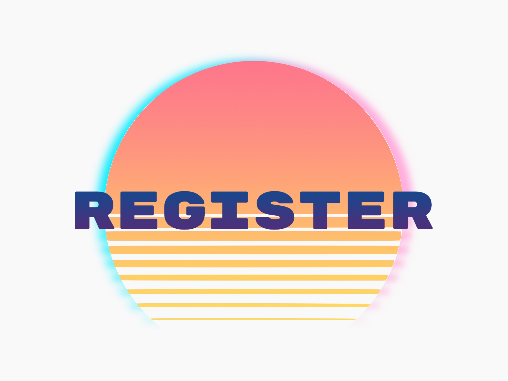
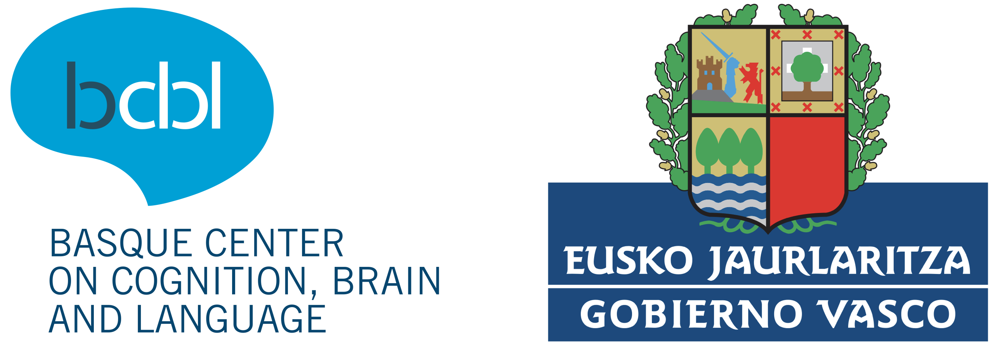

---
#
# You don't need to edit this file, it's empty on purpose.
# Edit sleeks's default layout instead if you wanna make some changes
# See: https://jekyllrb.com/docs/themes/#overriding-theme-defaults
#
layout: default
title:
---

Welcome back to a fresh new edition of Brainhack Donostia!

From the BrainHack organizing team we are happy to present Brainhack Donostia 2021. A gender-balanced board of researchers from BCBL invites you to join a three-day online workshop focused on project development to foster new ideas, findings and future collaborations. In addition, we will host four international keynote speakers that will share their experience on state of the art methods, good practices in science and hot topics in research nowadays. By doing so, we will continue to grow our contributions towards sharing knowledge openly and transparently across disciplines and specialties, and to the development of open-source tools.

Brainhack Donostia is not an ordinary conference but an event focused on cooperation and collaboration in Neuroscience, as well as the promotion of Open Science. Our aim is to explore the multiple applications of neuroscience from a cross-disciplinary perspective. With this goal in mind, we bring together students, researchers, users, and non-academic industry professionals to learn about and develop collaborative projects. Brainhack Donostia is part of a larger initiative that holds simultaneous events all over the world with this same goal ([brainhack.org](https://brainhack.org)). A cornerstone of Brainhack is the promotion of responsible research and innovation in an inclusive, open, and transparent manner. Accordingly, knowledge sharing activities and the use of open-source resources are two of the basic tenets of Brainhack.

If you'd like to know more about what the different working groups have prepared for this year's edition, go check out our [schedule](https://brainhack-donostia.github.io/schedule/)!

<!-- ## Registration

Registration for Brainhack Donostia 2021 is still **OPEN**!

This year's edition will be held online, which means it will be **completely free** for participants and we will be able to host people from all around the world, making this year's edition bigger, better, and even more inclusive than ever before!

 -->

## Acknowledgements

The Organising Committee would like to thank the <a href="https://www.bcbl.eu/en" target="_blank">Basque Center on Cognition, Brain and Language</a>, as well as everyone who put a lot of work into this event for helping this year's edition come to life.

